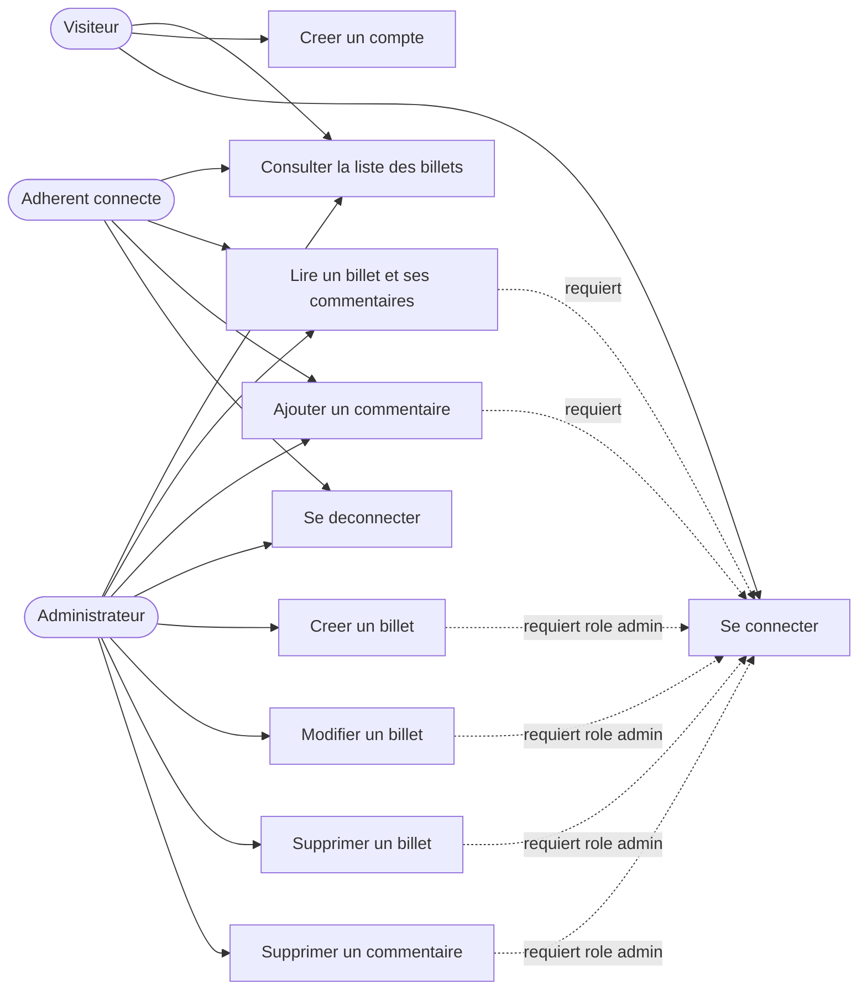
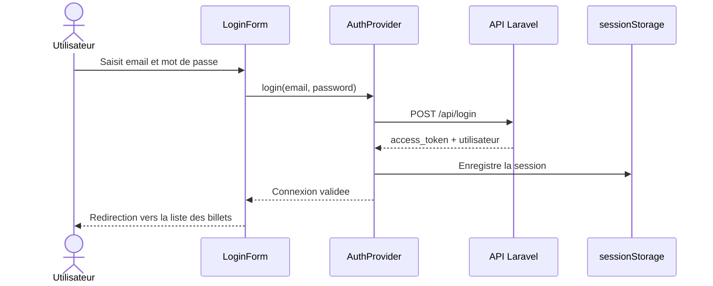
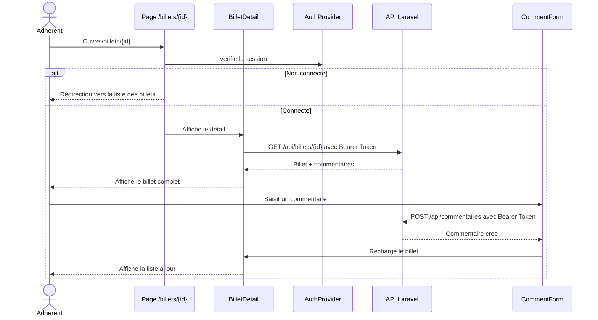
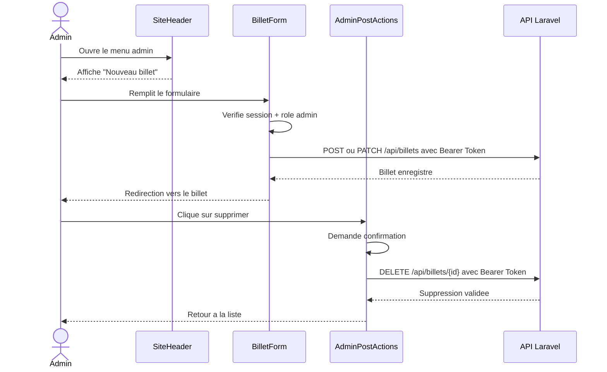
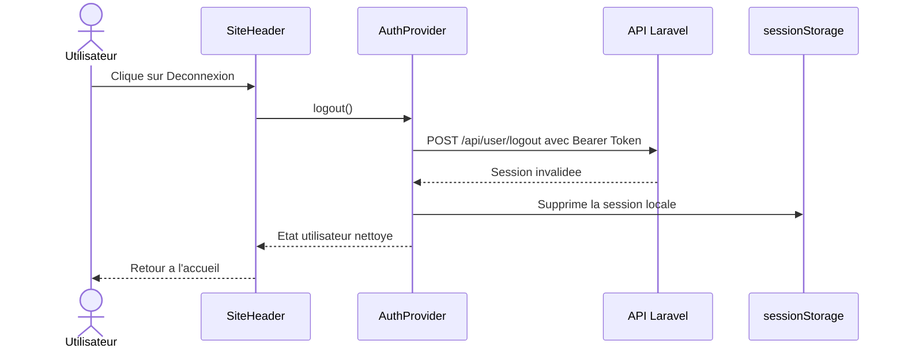
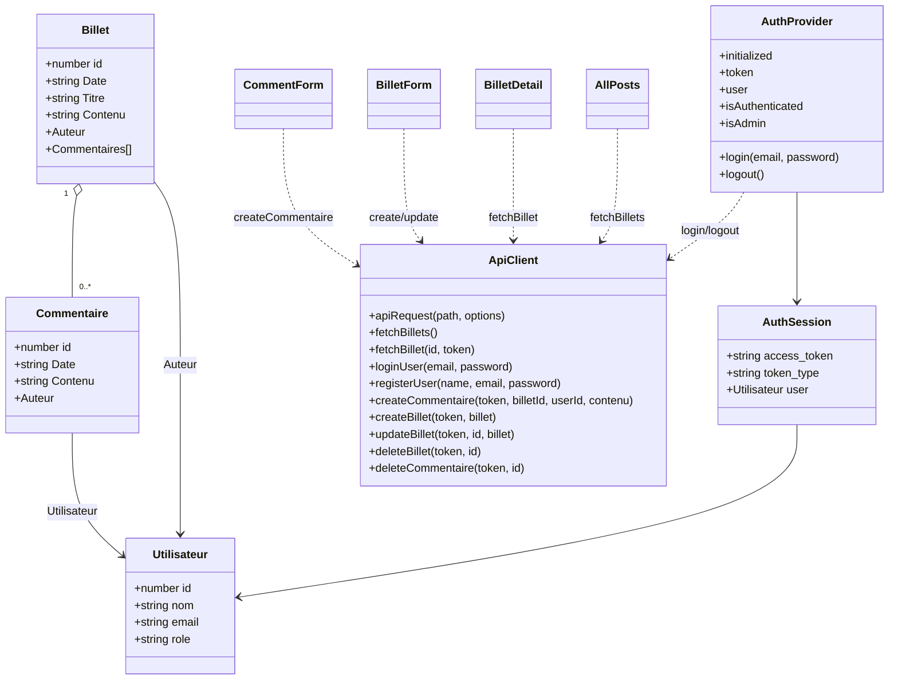

# B2LP - Documentation technique du front web

Application front du blog Lyon Palme, developpee avec Next.js, React et TypeScript.

Ce depot correspond au client web du projet `API_B2LP`. Il permet de consulter les billets du blog, de se connecter, de commenter les billets et d'administrer les contenus selon le role de l'utilisateur.

Mise a jour : Juin 2026.

---

## 1. Presentation

L'application B2LP est la partie web du blog Lyon Palme.

Elle permet :

- aux visiteurs de consulter la liste des billets ;
- aux visiteurs de creer un compte et de se connecter ;
- aux adherents connectes de lire le detail d'un billet et ses commentaires ;
- aux adherents connectes d'ajouter un commentaire ;
- aux administrateurs de creer, modifier et supprimer des billets ;
- aux administrateurs de lire, ajouter et supprimer des commentaires.

La gestion des donnees, des roles et des autorisations finales est faite par l'API Laravel. Le front gere l'affichage, la navigation, les formulaires et la session utilisateur.

---

## 2. Stack technique

| Couche | Technologie |
|---|---|
| Framework front-end | Next.js 16 |
| Bibliotheque UI | React 19 |
| Typage | TypeScript |
| Styles | Tailwind CSS v4 |
| Appels HTTP | Axios |
| API back-end | Laravel avec authentification Bearer Token |
| Stockage session | `sessionStorage` cote navigateur |

---

## 3. Installation

Cloner le projet :

```bash
git clone <url-du-repo-front>
cd monblog_gitlab
```

Installer les dependances :

```bash
npm install
```

Si besoin, creer un fichier `.env.local` pour changer l'URL de l'API :

```bash
NEXT_PUBLIC_API_BASE_URL=https://monblog.cherifhammani.fr/api
```

Si cette variable n'est pas definie, l'application utilise deja cette URL par defaut dans `components/types.ts`.

---

## 4. Lancement en local

Demarrer le serveur de developpement :

```bash
npm run dev
```

Puis ouvrir :

```txt
http://localhost:3000
```

Commandes utiles :

| Commande | Role |
|---|---|
| `npm run dev` | Lance le serveur de developpement |
| `npm run lint` | Lance ESLint |
| `npm run build` | Compile l'application pour la production |
| `npm run start` | Lance le build de production |
| `npm audit` | Verifie les vulnerabilites des dependances |

---

## 5. Structure principale

```txt
app/
  page.tsx                         Liste des billets
  layout.tsx                       Layout racine avec AuthProvider et SiteHeader
  login/page.tsx                   Page de connexion
  register/page.tsx                Page d'inscription
  billets/[id]/page.tsx            Page detail d'un billet
  admin/billets/new/page.tsx       Creation d'un billet
  admin/billets/[id]/edit/page.tsx Modification d'un billet

components/
  api.ts                           Appels vers l'API Laravel
  AuthProvider.tsx                 Session, connexion et deconnexion
  SiteHeader.tsx                   Navigation selon l'etat de connexion
  AllPosts.tsx                     Liste des billets
  BilletDetail.tsx                 Detail d'un billet et commentaires
  BilletForm.tsx                   Formulaire de creation/modification
  CommentForm.tsx                  Formulaire d'ajout de commentaire
  AdminPostActions.tsx             Modification/suppression d'un billet
  DeleteCommentButton.tsx          Suppression d'un commentaire
  EditBilletClient.tsx             Chargement client avant modification
  types.ts                         Types TypeScript partages

next.config.ts                     Headers de securite HTTP
package.json                       Scripts et dependances
```

---

## 6. Fonctionnement general

Le fichier `components/api.ts` centralise les appels HTTP vers l'API Laravel.

Fonctions principales :

- `fetchBillets()` : recupere la liste des billets ;
- `fetchBillet(id, token)` : recupere le detail d'un billet et ses commentaires ;
- `loginUser(email, password)` : connecte un utilisateur ;
- `registerUser(name, email, password)` : cree un compte adherent ;
- `logoutUser(token)` : deconnecte l'utilisateur cote API ;
- `createCommentaire(token, billetId, userId, contenu)` : ajoute un commentaire ;
- `createBillet(token, billet)` : cree un billet ;
- `updateBillet(token, id, billet)` : modifie un billet ;
- `deleteBillet(token, id)` : supprime un billet ;
- `deleteCommentaire(token, id)` : supprime un commentaire.

La session est geree dans `components/AuthProvider.tsx`. Apres connexion, le token renvoye par l'API est conserve dans `sessionStorage` sous la forme d'une session complete (`access_token`, `token_type`, `user`). Les routes protegees envoient ensuite :

```txt
Authorization: Bearer <token>
```

Regles d'acces :

- visiteur non connecte : consulte uniquement la liste des billets ;
- visiteur non connecte : peut s'inscrire ou se connecter ;
- nouvel inscrit : devient automatiquement adherent ;
- adherent connecte : consulte la liste, ouvre un billet, lit ses commentaires et ajoute un commentaire ;
- administrateur : consulte, cree, modifie et supprime les billets ;
- administrateur : lit, cree et supprime les commentaires.

---

## 7. API utilisee

API Laravel :

```txt
https://monblog.cherifhammani.fr/api
```

Routes principales :

| Methode | Route | Auth | Role |
|---|---|---|---|
| `GET` | `/api/billets` | Non | Liste des billets |
| `GET` | `/api/billets/{id}` | Oui | Detail d'un billet et commentaires |
| `POST` | `/api/login` | Non | Connexion |
| `POST` | `/api/register` | Non | Inscription |
| `POST` | `/api/user/logout` | Oui | Deconnexion |
| `POST` | `/api/commentaires` | Oui | Ajout d'un commentaire |
| `DELETE` | `/api/commentaires/{commentaire}` | Oui | Suppression d'un commentaire par admin |
| `POST` | `/api/billets` | Oui | Creation d'un billet par admin |
| `PATCH` | `/api/billets/{billet}` | Oui | Modification d'un billet par admin |
| `DELETE` | `/api/billets/{billet}` | Oui | Suppression d'un billet par admin |

Le controle reel des droits reste cote API. Les controles du front servent surtout a afficher ou masquer les actions disponibles.

---

## 8. Cas d'utilisation



---

## 9. Diagrammes de sequence

### Connexion



### Lecture d'un billet et ajout d'un commentaire



### Administration d'un billet



### Deconnexion



---

## 10. Diagramme de classes utile cote front

Le diagramme de classes complet des entites metier a plus sa place dans le depot Laravel. Dans ce depot front, le diagramme utile montre surtout les types TypeScript, le client API et les composants qui les utilisent.



---

## 11. Securite

Mesures presentes dans le front :

- headers HTTP configures dans `next.config.ts` ;
- `Content-Security-Policy` avec restriction des scripts, styles, images, frames, objets et connexions ;
- `connect-src` limite au site lui-meme et a l'origine de l'API configuree ;
- `X-Frame-Options: DENY` et `frame-ancestors 'none'` contre le clickjacking ;
- `X-Content-Type-Options: nosniff` contre le MIME sniffing ;
- `Referrer-Policy: strict-origin-when-cross-origin` ;
- `Permissions-Policy` pour bloquer camera, micro, geolocalisation, paiement et USB ;
- `Strict-Transport-Security` pour la production HTTPS ;
- `Cache-Control: no-cache, no-store, must-revalidate` sur `/login`, `/register` et `/admin/*` ;
- `X-Powered-By` desactive via `poweredByHeader: false` ;
- pas d'utilisation de `dangerouslySetInnerHTML` pour afficher les contenus des billets/commentaires ;
- token conserve en `sessionStorage`, donc supprime a la fermeture de l'onglet/session navigateur ;
- validation front minimale sur les formulaires, avec validation definitive cote API.

Points importants :

- le front masque les boutons admin, mais la vraie protection doit rester dans l'API Laravel ;
- un token Bearer dans un navigateur reste sensible en cas de XSS, d'ou l'interet de la CSP et de ne jamais injecter de HTML non fiable ;
- OWASP ZAP devra aussi tester l'API, car les failles d'autorisation, CORS, validation serveur et rate limiting ne peuvent pas etre garanties uniquement depuis ce depot front.

Derniere verification locale realisee le 01/06/2026 :

```txt
npm audit -> 0 vulnerabilities
npm run lint -> OK
npm run build -> OK
```

---

## 12. Tests et verification avant rendu

Avant de presenter ou deployer :

```bash
npm run lint
npm audit
npm run build
```

Pour un passage OWASP ZAP, tester de preference un build de production :

```bash
npm run build
npm run start
```

Puis scanner :

```txt
http://localhost:3000
```

---

## 13. Deploiement

Avant de deployer :

```bash
npm install
npm run build
```

Sur un VPS, recuperer la derniere version :

```bash
git pull origin main
npm install
npm run build
npm run start
```

Configurer `NEXT_PUBLIC_API_BASE_URL` si l'API change d'adresse.

---

## 14. Lien avec le webservice

Le front depend du webservice Laravel `API_B2LP`.

Repo du webservice :

```txt
https://github.com/cherif74hmxi/API_B2LP
```
